# Report

## Indice

1. [Introduzione](#introduzione)
2. [Modello di dominio](#modello-di-dominio)
3. [Requisiti specifici](#requisiti-specifici)
4. [System Design](#system-design)
	- [Stile architetturale](#stile-architetturale)
	- [Diagramma dei package](#diagramma-dei-package)
	- [Diagramma dei componenti](#diagramma-dei-componenti)
	- [Commenti delle decisioni prese](#commenti-delle-decisioni-prese)
5. [OO Design](#oo-design)
	- [Diagramma delle classi e diagramma di sequenza](#diagramma-delle-classi-e-diagramma-di-sequenza)
		- [User Stories sprint 1](#user-stories-sprint-1)
		- [Esempio di una user story dello sprint 1](#esempio-di-una-user-story-dello-sprint-1)
		- [User Stories sprint 2](#user-stories-sprint-2)
		- [Esempio di una user story dello sprint 2](#esempio-di-una-user-story-dello-sprint-2)
	- [Commento delle decisioni prese](#commento-delle-decisioni-prese)
6. [Riepilogo del test](#riepilogo-del-test)
	- [Tabella riassuntiva di coveralls](#tabella-riassuntiva-di-coveralls)
7. [Manuale utente](#manuale-utente)
8. [Processo di sviluppo e organizzazione del lavoro](#processo-di-sviluppo-e-organizzazione-del-lavoro)
9. [Analisi retrospettiva](#analisi-retrospettiva)
	- [Commenti positivi durante il pre post sviluppo](#commenti-positivi-durante-il-pre-post-sviluppo)
	- [Commenti negativi durante il pre post sviluppo](#commenti-negativi-durante-il-pre-post-sviluppo)
	- [Problematiche riscontrate](#problematiche-riscontrate)

<ol>
<li>

## Introduzione

### Sna4so

sna4so è un’applicazione di social network analysis (SNA) applicata a Stack Overflow (SO), con interfaccia a linea di comando (CLI).
* Il modello è un grafo orientato:
  - I nodi sono gli utenti
  - Gli archi diretti partono dall’utente che risponde all’utente che ha posto una domanda 
* Base di dati (sola lettura): accesso al dump del 2016/06 di Stack Overflow attraverso l'API di Google BigQuery

</li>
<li>

## Modello di dominio

### Diagramma delle classi con prospettiva concettuale
Per modellare il dominio di Stack Overflow si utilizza il seguente diagramma UML:

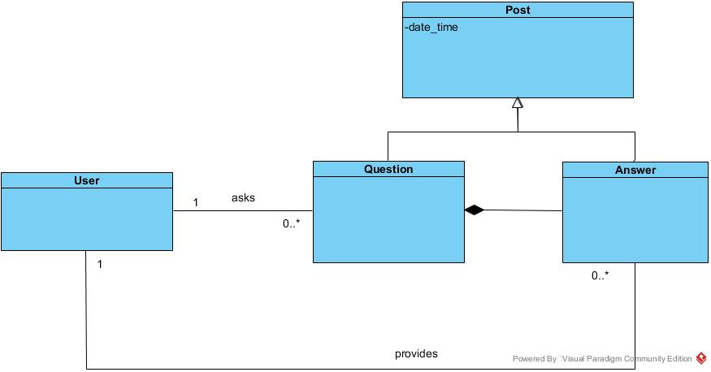

* Un `User` pone una o piu `Question` e allo stesso tempo può fornire una o più `Answer` alle medesime.
* `Question` e `Answer` sono specializzazioni di `Post` e inoltre una `Question` può essere composta da una o più `Answer`.
* All'eliminazione di una `Question` corrisponde l'eliminazione delle relative `Answer`.

</li>
<li>

## Requisiti specifici

Il sistema software soddisfa i seguenti requisiti, suddivisi in due macro funzionalità.
###  Visualizzare i nodi in forma tabulare accedendo alla Google Cloud API in lettura e scrittura.
	
	Tale requisito è stato soddisfatto attraverso sei funzionalità:
	1. Visualizzare la lista dei primi 100 id utente (User) che hanno fatto almeno una domanda (Question) in un dato anno, mese e giorno.
	2. Visualizzare la lista dei primi 100 id utente (User) che hanno dato almeno una risposta (Answer) in un dato anno, mese e giorno.
	3. Visualizzare la lista dei primi 100 id utente (User) che hanno fatto almeno un Post in un dato mese, anno, giorno (un Post può essere una domanda o una risposta).
	4. Visualizzare la lista dei primi 100 id utente (User) che hanno fatto almeno una domanda (Question) su un dato argomento (Tag) in un dato mese e anno.
	5. Visualizzare la lista dei primi 100 id utente (User) che hanno dato almeno una risposta (Answer) su un dato argomento (Tag) in un dato mese e anno.
	6. Visualizzare la lista dei primi 100 id utente (User) che hanno fatto almeno un Post su un dato argomento (Tag) in un dato mese e anno 
	   (un Post può essere una domanda o una risposta).
	
###  Visualizzare gli archi diretti in forma tabulare (gli archi diretti partono dall’utente che risponde e arrivano all’utente che ha posto una domanda).

	Tale requisito è stato soddisfatto attraverso sei funzionalità:
	1. Visualizzare la lista delle prime 100 coppie (from, to) relative a domande (Question) poste in un dato anno, mese e giorno.
	2. Visualizzare la lista delle prime 100 coppie (from, to) relative a domande (Question) poste da un determinato utente.
	3. Visualizzare la lista delle prime 100 coppie (from, to) relative a risposte (Answer) date da un determinato utente.
	4. Visualizzare la lista delle prime 100 triple (from, to, weight) relative a domande (Question) poste da un determinato utente.
	5. Visualizzare la lista delle prime 100 triple (from, to, weight) relative a domande (Question) poste da un determinato utente.
	6. Visualizzare la lista delle prime 100 triple (from, to, weight) relative a risposte (Answer) date da un determinato utente.
</li>	
<li>

## System design

### Stile architetturale

La creazione e l'aggiornamento degli eseguibili coinvolge una *toolchain* in *pipeline* ovvero una serie di tool collegati in sequenza in modo che l'output del precedente sia l'input del successivo, come da figura.

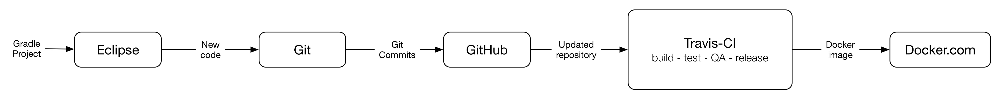

### Diagramma dei package

Il sistema software è organizzato secondo il seguente diagramma UML dei **package**:

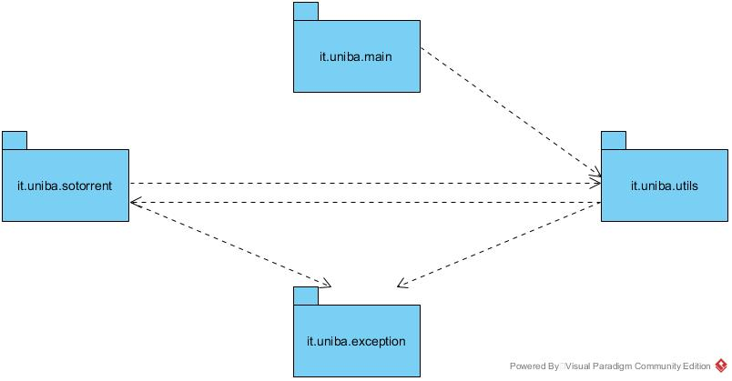

Il diagramma appena mostrato descrive come i vari package comunicano tra loro, ovvero quali sono le loro dipendenze.

* `it.uniba.main` contiene la main class **AppMain**
* `it.uniba.exception` contiene una serie di classi per le gestione delle eccezioni personalizzate
* `it.uniba.utils` ingloba una serie di classi per la verifica delle date **MathUtils**, il collegamento fra due nodi **Edge**, una classe per suddividere i parametri passati dal programma principale **Arguments** e **Control** per governare la sequenza di operazioni da eseguire. 
* `it.uniba.sotorrent` incapsula **SOQuery** e **GoogleDocsUtils** che rispettivamente contengono i metodi per effettuare le query sul DB e quelli relativi alla connessione al DB e alla scrittura sullo spreedshett di GoogleDrive

### Diagramma dei componenti

Il sistema è modellato in termini di componenti e dipendenze tra componenti come mostarto dal seguente diagramma UML dei **componenti**:

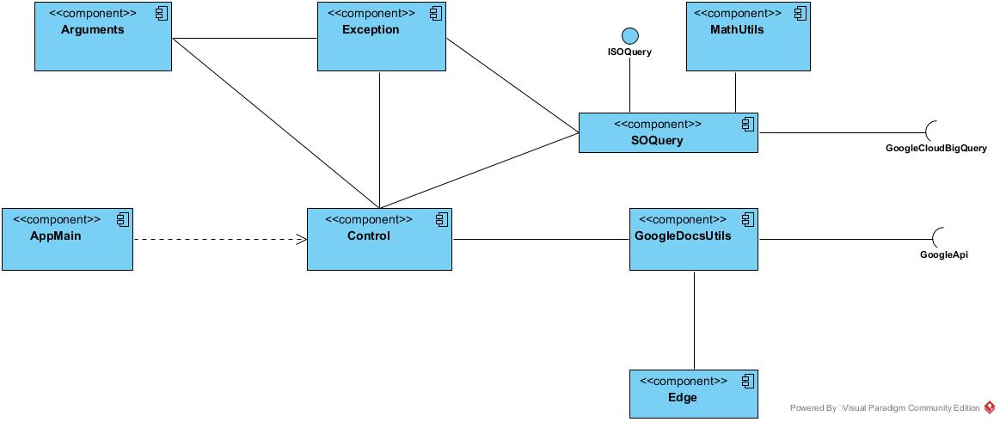

Il diagramma appena mostrato descrive come le varie componenti del sistema e come sono fra loro collegate.

* `GoogleCloudBigQuery` e `GoogleApi` sono due servizi esterni al sistema che si adoperano per effettuare connessione e query sul DB di StackOverflow e poter scrivere i risulatati della varie query su un foglio elettronico di google drive.
* `ISOQuery` è un interfaccia interna che viene implementata da `SOQuery` e contiene svariati metodi per effettuare le query.
* `Control` è il fulcro, infatti questa classe controlla i paramatri passati al programma principale e seleziona la query corretta da eseguire. Esegue le query e aggiunge i suoi risultati in una variabile ArrayList. Infine questa classe chiama `GoogleDocuUtils` che scrive il foglio di calcolo con i dati selezionati.

### Commenti delle decisioni prese

La fase di design è molto critica infatti le decisioni prese sopra citate sono state fatte per rendere il software estensibile.

* `Exception` è stata pensata per essere estensibile in futuro con nuove eccezioni non gestite in maniera standard ma personalizzabile. 
* `Edge` per gestire gli archi fra due nodi e peso(facoltativo).
* `Arguments` direziona gli argomenti passati al programma principale in variabili locali. 
</li>
<li>

## OO Design

### Diagramma delle classi e diagramma di sequenza

Sono stati realizzati due diagrammi delle classi, uno relativo alle classi che sono state chiamate in causa per soddisfare la user story in cui si chiedeva di visualizzare la lista degli utenti che hanno fatto almeno una domanda in un dato anno, mese e giorno (relativa allo sprint 1),
e uno relativo alle classi utilizzate per eseguire la user story in cui si chiedeva di visualizzare la lista delle coppie (from,to) relative a domande poste da un determinato utente.

### User Stories sprint 1

Segue l'immagine che rappresenta il diagramma delle classi relativo allo sprint 1:

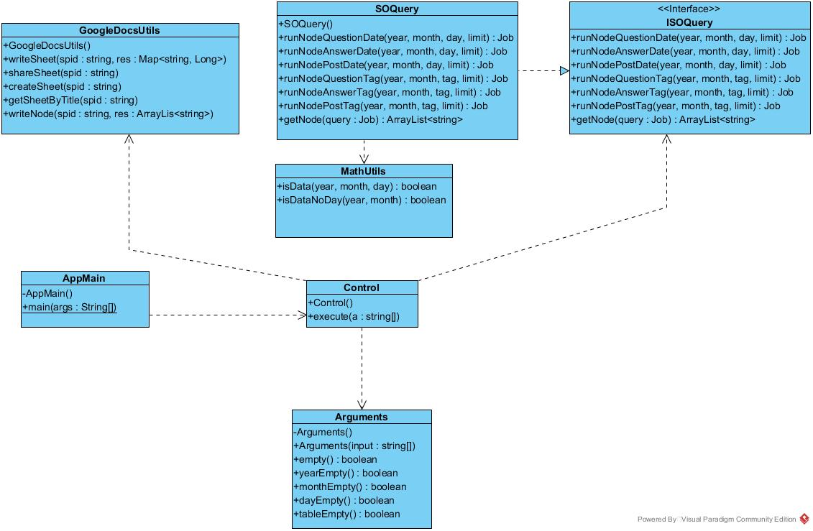

Scelte adottate:
*	Sono stati riportati solo i metodi utilizzati durante l'esecuzione della user story per non appesantire il diagramma;
*	Non è stato riportato alcun attributo di nessuna classe per lo stesso motivo del punto precedente.

Il diagramma di sequenza relativo alla suddetta user story è il seguente:

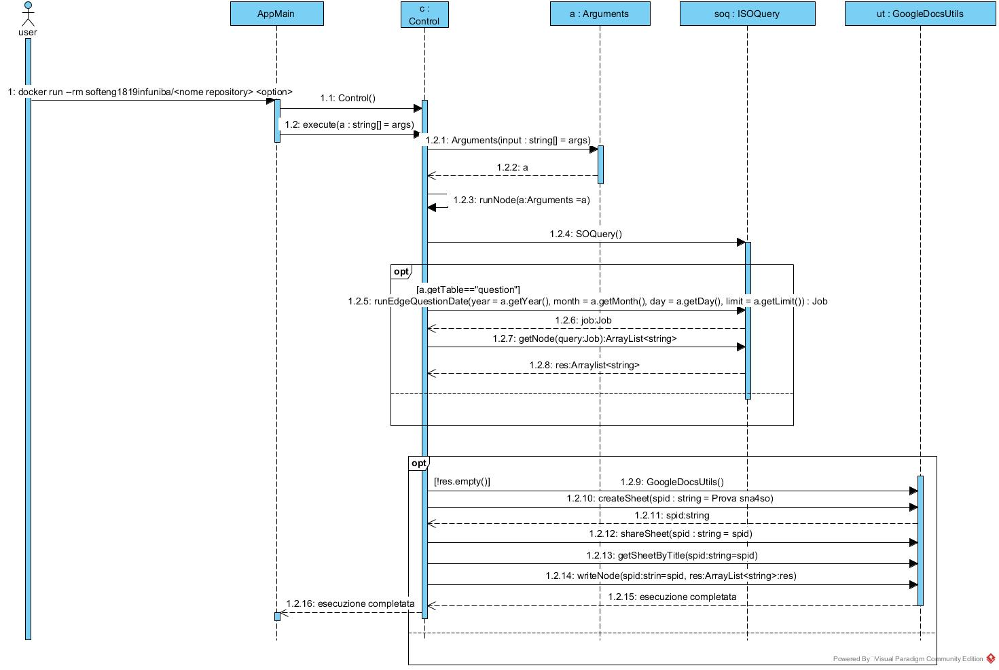

#### Esempio di una user story dello sprint 1

**US1S1 :** Visualizzare la lista dei primi 100 id utente (User) che hanno fatto almeno una domanda (Question) in un dato anno, mese e giorno

### User Stories sprint 2

Per quanto concerne, invece, i diagrammi relativi allo sprint 2, sono presenti, di seguito, le immagini relative al diagramma delle classi, e al diagramma di squenza

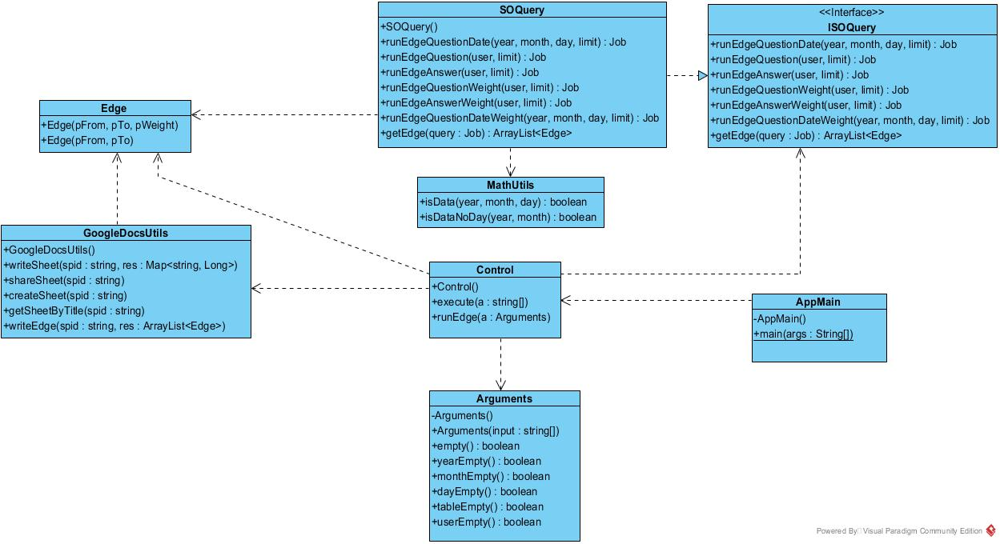
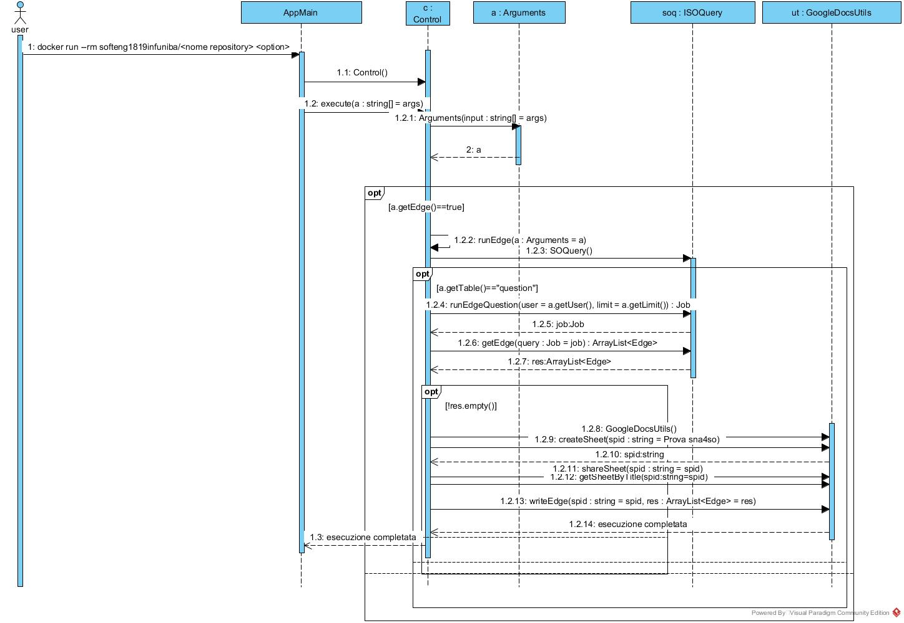

#### Esempio di una user story dello sprint 2

**US6S2 :** Visualizzare la lista delle prime 100 triple (from, to, weight) relative a risposte (Answer) date da un determinato utente. 

### Commento delle decisioni prese

Scelte adottate:
*	Per il diagramma delle classi sono stati aggiunti i metodi che sono stati utilizzati nello sprint 2 e sono stati rimossi quelli relativi allo sprint 1 per non sovraccaricare la rappresentazione diagrammatica;
*	è stata aggiunta la classe Edge che modella la struttura e il comportamento dell'arco;
*	Non è stata riportata nessun oggetto di classe Edge nel diagramma di sequenza perchè non è stato mai istanziato direttamente dalla classe chiamante Control, ma sempre attraverso metodi di classi esterne, come GoogleDocsUtils , oppure dalla classe ArrayList.

</li>
<li>

## Riepilogo del test

### Tabella riassuntiva di coveralls

Per verificare la copertura del codice prodotto è stato utilizzato **Coveralls** come mostrato in figura

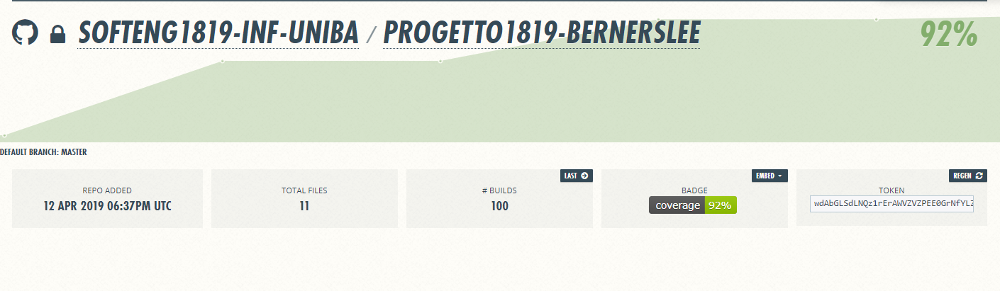

#### Dati sul numero dei casi di test e di copertura del codice

##### Di seguito sono mostrati i dati relativi alla copertura dei singoli package di Sna4so effettuati attraverso  il tool **Jacoco**.

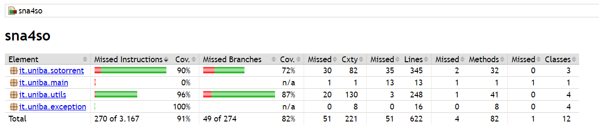

##### Per ogni package è possibile verificare la percentuale di copertura delle righe di codice coperte e quelle non verificate.

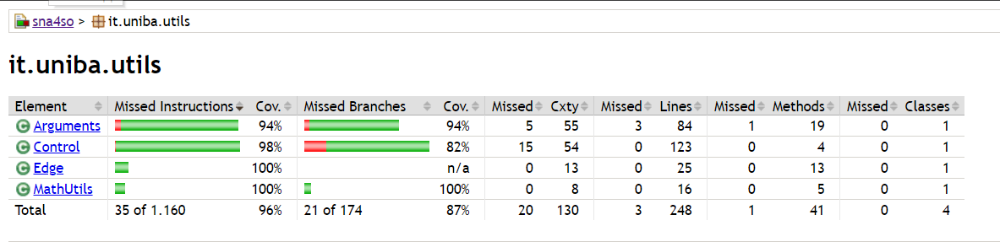

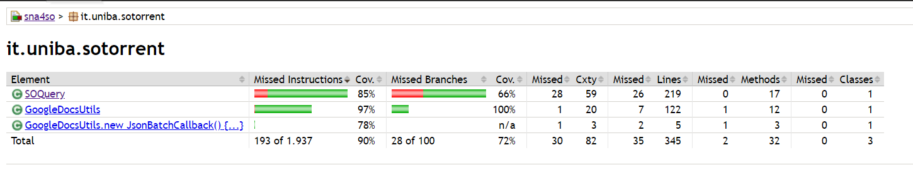

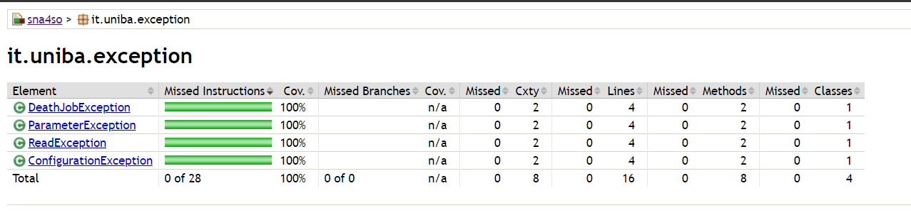

##### Per ogni classe è inoltre possibile verificare la copertura dei singoli metodi, di seguito un sempio per la classe GoogleDocsUtils

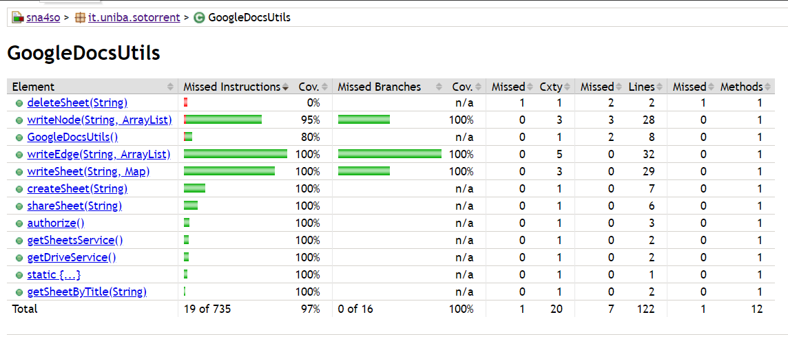

### FindBugs

Durante la codifica, man mano che venivano completati i moduli, abbiamo svolto delle attività di misurazione della qualità 
tramite analisi statica. Per l’analisi del codice Java abbiamo utilizzato FindBugs:
strumento che permette di effettuare analisi statica del codice a livello di bytecode alla ricerca di potenziali cause di
malfunzionamento (bug patterns) o adozione inconsapevole di worst practice.
Come indicava la guida dello studente, abbiamo scaricato lo strumento come estenzione di Eclipse seguendo i passaggi elencati nel sito:
http://findbugs.sourceforge.net/
in seguito abbiamo effettuato il controllo dei seguenti file: GoogleDocsUtils, SOQuery, MathUtils, Arguments, Edge
dove abbiamo riscontrato diversi bug di natura mista abbiamo generato il file html e verificato il tutto, 
consultando le guide alla risoluzione offerte dallo stesso findbugs, risolvendo
i seguenti errori abbiamo potuto eseguire con successo i test e verificare la funzionalità del codice e dell'intero applicativo.
L'estenzione fingbugs permette quindi di analizzare il codice e generare un html che indica bug e collocazione (indica la riga di
codice che presenta un bug)

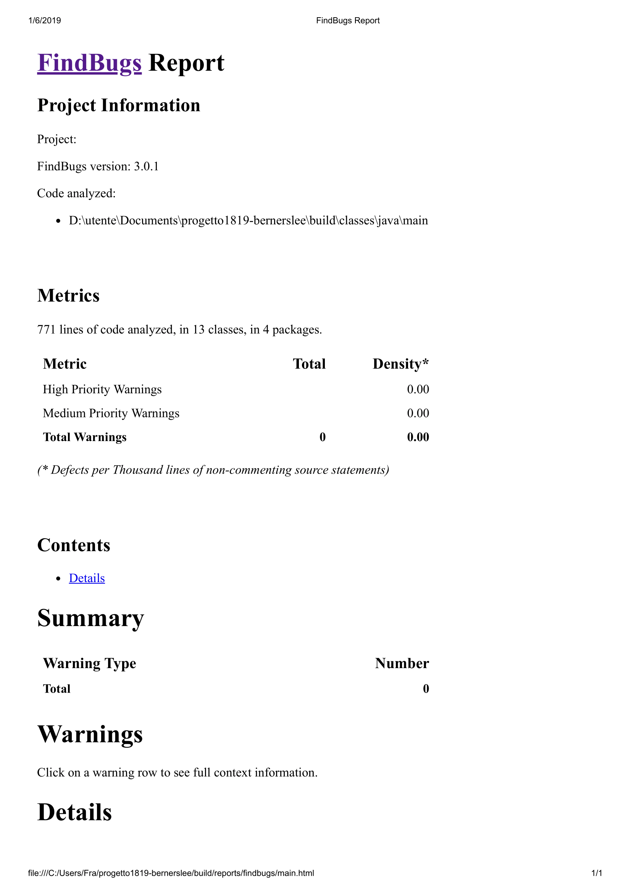

</li>
<li>

## Manuale utente
	
L'applicazione batch richiede l'utilizzo del software "Docker Desktop"
	
### **1.** **System Requirements per Docker**
		
	Windows 10 64bit: Pro, Enterprise or Education (Build 15063 o successiva).
	Virtualizazione attivata nel BIOS.
	CPU SLAT-capable feature.
	Mimimo 4GB di RAM.
	
Note: Se il sistema non soddisfa i requisiti per eseguire Docker Desktop per Windows, puoi installare [**Docker Toolbox**](https://docs.docker.com/toolbox/toolbox_install_windows/), che sfrutta [**Oracle Virtual Box**](https://www.virtualbox.org/) anziché [**Hyper-V**](https://blogs.technet.microsoft.com/pgmalusardi/2010/08/26/hyper-v-impostazioni-del-bios/).

### **2.** Scaricare [**Docker Desktop**](https://hub.docker.com/?overlay=onboarding) e Iscriversi a [**docker.com**](https://www.docker.com)

### **3.** Installare Docker Desktop seguendo la [**guida**](https://docs.docker.com/docker-for-windows/install/) del sito ufficiale

### **4.** Configurazione per l'immagine docker
	
Occorre scaricare l’immagine da [**docker.com**](https://hub.docker.com/) ed eseguire il container mediante l’installazione locale di Docker.
Si svolgano le seguenti operazioni:
- avviare Docker localmente (una volta aperta l’applicazione, bisogna attendere che nel menu di Docker compaia la scritta “Docker is running”)
- accedere al profilo Docker.com creato in precedenza
- se si utilizza Windows selezionare `Switch to Linux containers` nel menu di Docker
- aprire il terminale (CMD) e spostarsi nella cartella in cui è istallato Docker 	
		
default dir:	`C:\Program Files\Docker\Docker\resources\bin`
		
- digitare nel terminale (CMD) il seguente comando:`

		docker pull softeng1819infuniba/<nome_repository>

Nel caso specifico, **softeng1819infuniba** è il nome della organization che ospita i repository del corso.

Attendere che Docker scarichi l’immagine dell’applicazione.

- digitare il comando:

		docker run --rm softeng1819infuniba/<nome_repository>

L’applicazione verrà eseguita in un container sul computer locale. Il nome dell'applicazione coincide con il nome del repository e quindi non avrete modo di chiamare l'applicazione *sna4so*. Potrete invece passare parametri aggiungendo stringhe in coda al comando. Per esempio:

		docker run --rm softeng1819infuniba/<nome_repository> help

**N.B.:**
1. l’opzione `—-rm` serve per far sì che docker fermi l’esecuzione del container nel momento in cui l’applicazione eseguita al suo interno termina.
2. Si assume per default la versione *:latest* dell'immagine caricata su *docker.com* e quindi si omette di specificare esplicitamente il `<version_number>`

### **5**. Esecuzione via Docker attraverso il comando:
```
docker run --rm softeng1819infuniba/<nome_repository> <options>
``` 
`<options>` include i seguenti parametri di input:
   - `type`: il tipo di post cercato in Stack Overflow, definito in `{question,answer,post}` (es., `type=post`)
   - `yyyy`: l'anno in cui un post è stato creato (es., `yyyy=2012`)
   - `mm`: il mese in cui un post è stato creato (es., `mm=01`)
   - `dd`: il giorno in cui un post è stato creato (es., `dd=07`)
   - `taglike`: la sottostringa da cercare nei tag applicati alle domande (es., `taglike=java` varrà per le domande taggate con `java`, `java9`, etc.)
   - `limit`: il limite al numero di risultati da restituire in una query (es., `limit=1000`)
   - `edge`: l'opzione per indicare che l'output deve includere gli archi (es., `edge=yes`); il default è output di soli nodi
   - `weight`: l'opzione per indicare che l'output relativo agli archi deve includere anche i pesi (es. `weight=yes`); il default è output di archi senza pesi
   - `user`: l'id dell'utente che ha creato un post (es. `user=86`)

### Output atteso
Al termine di ogni esecuzione di sna4so (output):
  1. i risultati di una query sono salvati in un Google Spreedsheet attraverso le relative API
  2. l'applicazione stampa a console l'url per acceddere via web a tale foglio di calcolo
  3. il foglio di calcolo deve essere accessibile in lettura a chiunque abbia il link
  4. il foglio di calcolo deve poter essere salvato in locale in formato CSV

</li>
<li>

## Processo di sviluppo e organizzazione del lavoro

Lo sviluppo del sistema software è stato eseguito da un team di 7 componenti. Lo stile di processo utilizzato è stato quello **iterativo**: suddividere il progetto in base a sottoinsiemi di funzionaità
(itearazioni). Si è utilizzato **Scrum** un processo di sviluppo agile.

I progressi del progetto sono stati effettuati in una serie di iterazioni detti *sprint*, ogni sprint hanno avuto una durata costante di circa 2 settimane. Ogni sprint aveva una lista di requisiti da sviluppare, le stime di ogni funzionalità sono state stabilite dai membri
del gruppo. Ogni funzionalità è stata trattata come una *user story* ed assegnata ad uno o più membri del team di sviluppo. Qualsiasi membro del team ha potuto aggiungere cancellare e modificare gli elementi.

Ad ogni sprint è stata utilizzata una `scrum board` digitale che riassume lo stato di ogni user story dalla sua nascita (To do) fino alla sua conlusione (Done).

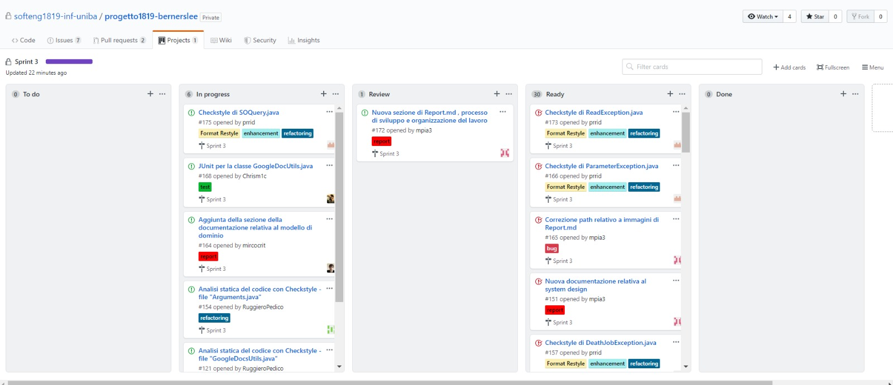

Ogni sprint è stato intodotto da uno `sprint planning` guidato dal **product owner** che sceglieva lo `sprint goal`(obiettivo dell'iterazione). 

Il team successivamente ha creato lo `sprint backlog` in cui si è dato un design preliminare e identificato i task e la loro stima in ore.  Ogni giorno è stato effettuato il `Daily scrum meeting` della durata di 10-15 minuti in cui ogni membro del team ha esposto i suoi problemi e il lavoro fatto precedentemente al meeting e quello
che avrebbe fatto dopo il meeting.
Ad ogni fine iterazione è seguita lo `Sprint review` in cuoi sono stati presentati i risultati raggiunti durante lo Sprint. 

### Lavoro sul codice dell' applicazione

Il workflow utilizzato da ogni membro del team è stato il **Github Flow** in cui sono stati eseguiti i seguenti passi:

**1.** Subito prima di lavorare sul codice, è stato opportuno eseguire una git pull e lavorare sul codice più aggiornato.

**2.** Per ogni nuova feature user story o bug fix è stato creato o scelta l’issue su cui lavorare su GitHub e segnarsi come assigned.

**3.** E' stato creato un nuovo branch sul repository locale con il numero dell'issue o il titolo come nome del branch (issue#n oppure titoloissue) attraverso il comando `git branch <nome branch>`.

**4.** Spostarsi sul nuovo branch appena creato con il comando `git checkout <nome branch>`.

**5.** Lavorare al codice dell’applicazione. Effettuate piccole commit autoconsistenti di volta in volta, con uno scopo ben preciso ed una descrizione dettagliata. Evitando di fare un’unica grande commit alla fine del lavoro, a meno che la feature o il bug fix non sia stato davvero di poco conto.

**6.** Aggiornato con regolarità il branch sul server origin in GitHub con il comando `git push origin <nome branch>`.

**7.** Ogni parte del codice correttamente implementata è stata testata con opportuni test di unità.

**8.** Dopo l’esecuzione dei test è  stato possibile lanciare gli strumenti di Quality Assurance (checkstyle e findbugs) per assicurare di aver scritto codice di qualità.

**9.** A questo punto, dunque, si è potuto procedere all'apertura di una pull request, andando su GitHub e posizionandosi sul branch su cui si stava lavorando.

**10.** Scritto un titolo conciso ed esplicativo per la pull request e una descrizione significativa per il revisore come commento, incluso un riferimento all'issue nella forma closes #n. Scelto almeno un reviewer tra i componenti del team.

**11.** Una volta lanciata la pull request, si è attivata la costruzione automatica della build e si è atteso qualche minuto. In caso di conflitti, è stao opportuno risolverli.

**12.** Discussione di eventuali commenti dei reviewer e apportate le modifiche se necessarie come commit sul branch di lavoro.

**13.** Ricevuta l'approvazione esplicita di almeno un componente del team, si è potuto procedere da GitHub al merge del nuovo branch con il master branch sul repository remoto.

**14.** Se la build Travis e il merge su GitHub sono entrambi andati a buon fine, per completare il lavoro, è stato cancellato il branch sul repository remoto (mediante interfaccia web di GitHub) e sul repository locale con la sequenza di comandi: `git checkout master, git pull e git branch -d <nome branch>`.

</li>
<li>

## Analisi retrospettiva

### Commenti positivi durante il pre-post sviluppo

* Il funzionamento della release finale e il feedback positivo ricevuto al termine di ogni sprint da parte del docente è stato incoraggiante per il proseguimento dei successivi sprint.
* Positivo il fatto di poter eseguire comandi da un software esterno (docker) e visualizzarne i risultati in un foglio elettronico di google con relativa semplicità.
* Esecuzione del software su piattaforme differenti grazie all'utilizzo dei container `Docker`.
* Lo sviluppo del progetto è stato utile per comprendere le dinamiche di sviluppo tipiche di java e di ingegnerizzazione del software, comprese le fasi di sviluppo, e relativi tool utilizzati.
* Positivo l'utilizzo di API per interrogare DB molto grandi e non di nostra creazione.

### Commenti negativi durante il pre-post sviluppo

* I tempi stringenti hanno tuttavia creato tensione nei singoli membri del team, con conseguente sviluppo non sempre ottimale, soprattutto nella fase finale.
* I casi di test sono stati veramente impegnativi data l'elevata curva d'apprendimento del framework `JUnit degli unit test effettuati per le classi.
* Impegnatvio è stata la comprensione con relativa realizzazione dei vari diagrammi UML e dell'individuazione dei design pattern.

### Problematiche riscontrate

* Nulla di così negativo ci ha "fatto impazzire", eccetto il dover mettere insieme tool molto diversi e completarli in poco tempo durante lo sprint 3.

</li>
</ol>
